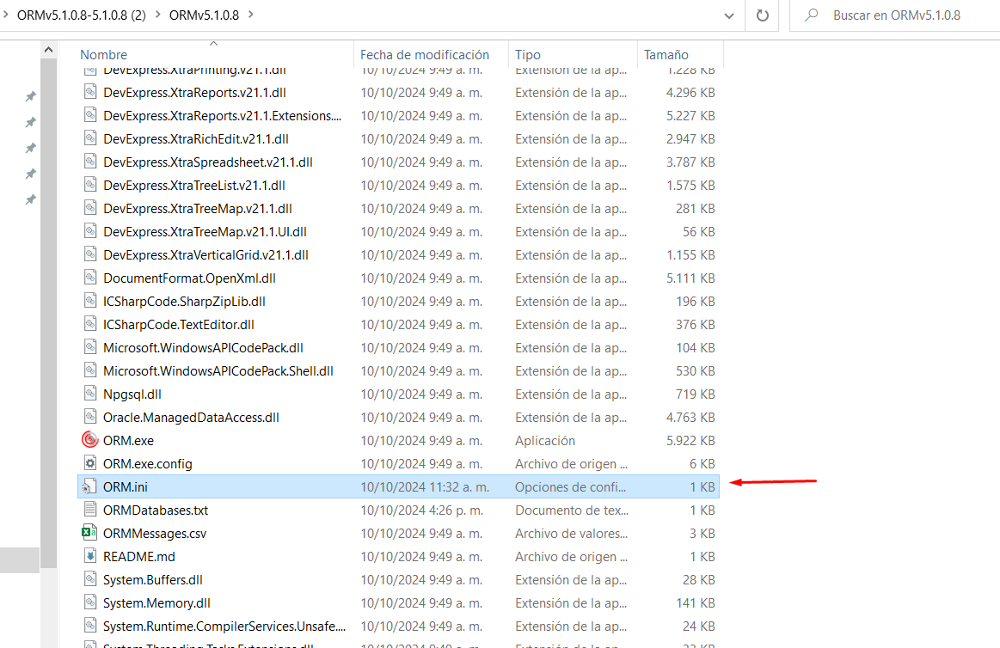
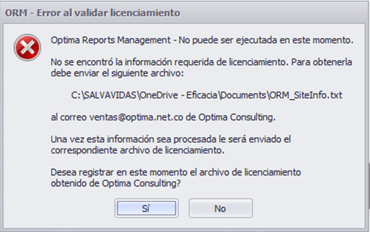
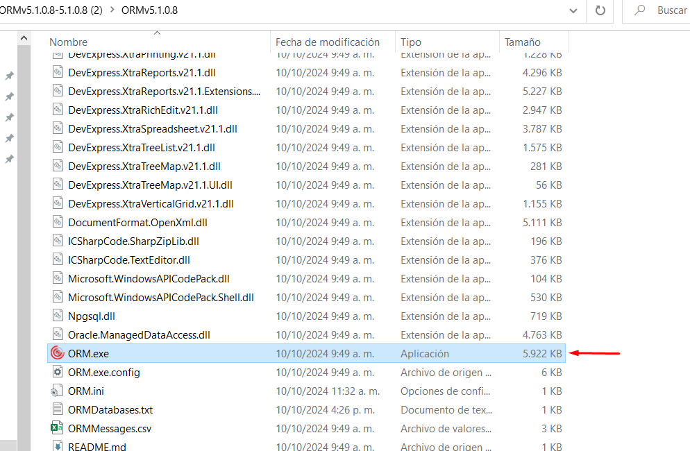
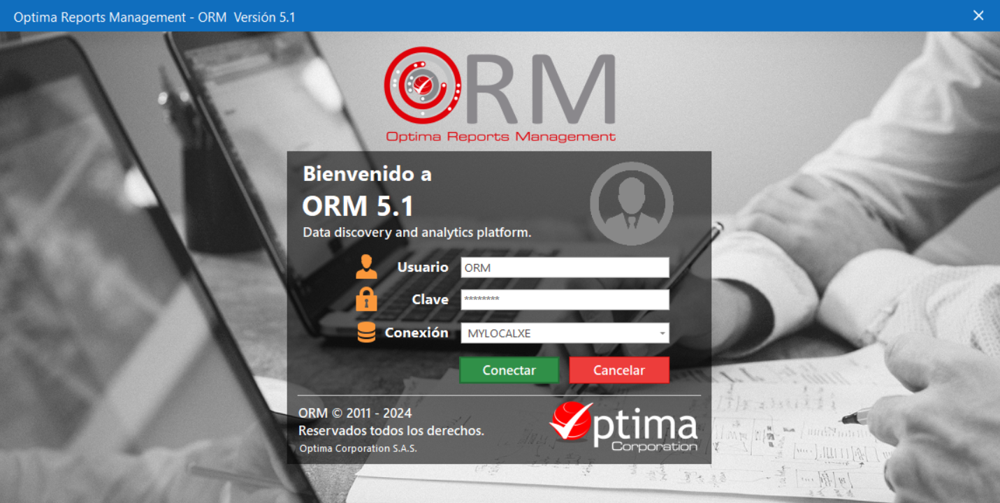
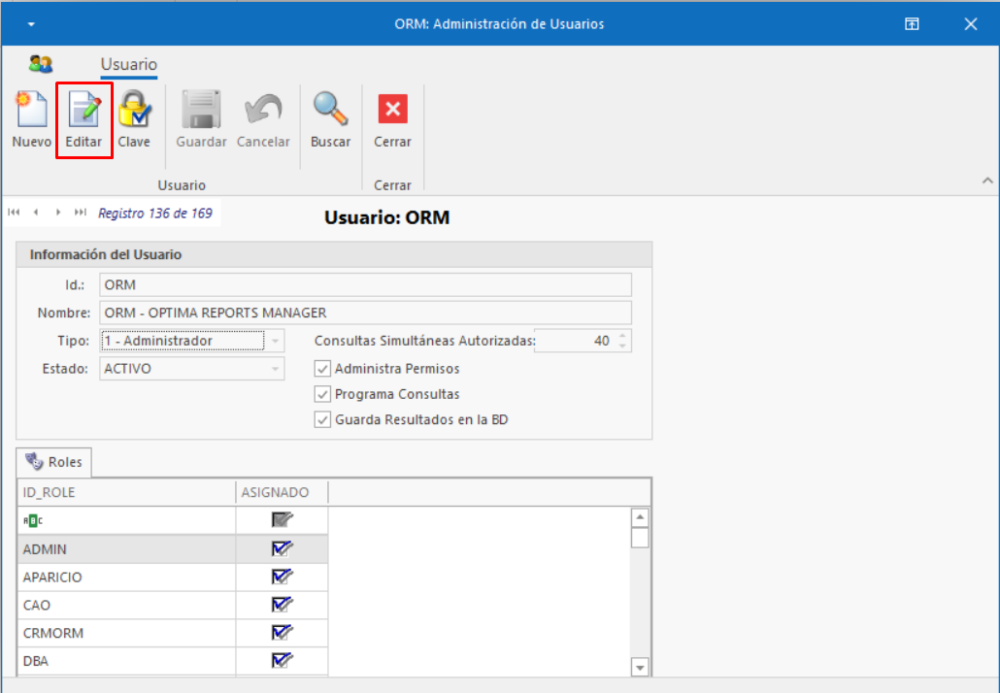
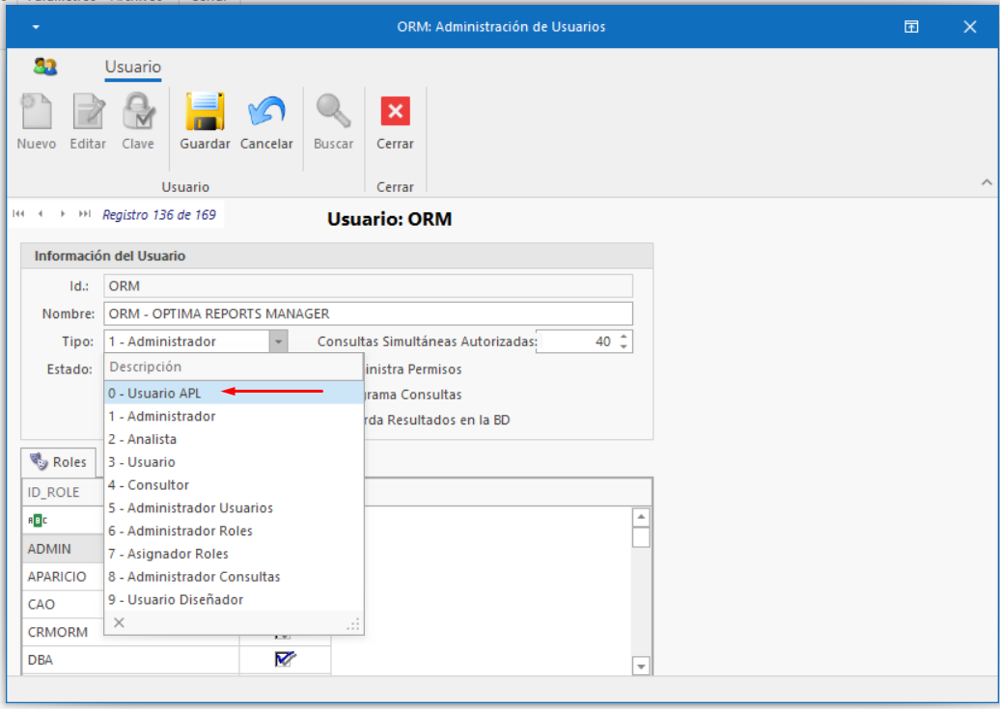
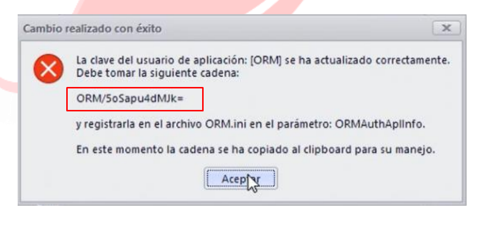
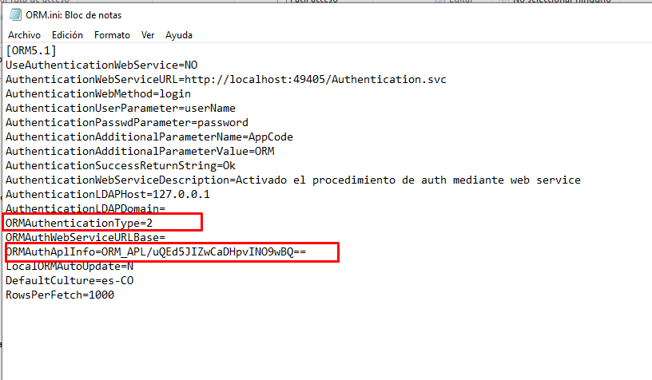

# Guía de Instalación ORM v5.1.0.8

## Introducción
Este repositorio contiene las instrucciones detalladas para llevar a cabo la instalación completa del ORM, tanto a nivel de la base de datos como en la capa del cliente.

## Instalación de Scripts en la Base de Datos para la creación del esquema ORM

**<u>Importante:</u>**
<u>Antes de comenzar con la instalación de los objetos en la base de datos, es fundamental realizar los ajustes pertinentes según sus necesidades. Esto incluye modificar nombres de usuarios, ubicaciones de datafiles, tablespaces, entre otros.</u>

## Implementación de Objetos
Para la instalación de los componentes sobre base de datos, siga el siguiente orden:

1. Ejecute los scripts del **00-02** utilizando el usuario **SYS**.
2. Ejecute los scripts del **03-07** utilizando el usuarios **ORM**.
3. Cada que ejecute un script debe validar su correcta aplicación.
4. Para finalizar puede validar que todos los objetos quedaron aplicados correctamente usando el script **08**, el cual contiene una consulta que muestra un listado detallado de cada item aplicado.
4. Ante cualquier error o novedad presentada por favor comunicarse con el área de soporte de Optima.

# Instalación interfaz de usuario 

1. Descargar archivo .zip llamado ORMv5.1.0.8 y pegarlo en una ruta segura como documentos o Carpeta en disco local
2. Una vez descomprimido debe dirigirse al archivo llamado ORM.ini el cual debe aparecer de la siguiente manera:

    


3. Una vez dentro del archivo debe dirigirse a la línea de ```ORMAuthenticationType ``` y debe cambiarla a tipo 1, es decir ```ORMAuthenticationType=1 ```

    * Debe quedar de la siguiente manera:

    

    Nota: Este paso se realiza para continuar con el ingreso al aplicativo usando credenciales de bases de datos, es decir que cuando se desee ingresar con usuarios de base de datos el parámetro ```ORMAuthenticationType ``` debe estar en 1, cuando se desea ingresar con usuarios del aplicativo se el parametro ```ORMAuthenticationType ``` debe estar en 2

    ```ORMAuthenticationType=1``` --Usuario base de datos.
    ```ORMAuthenticationType=2``` --Usuario aplicativo.

4. Configuramos el archivo ```ORMDatabases.txt``` en este archivo se debe ingresar la cadena de conexión correspondiente, por ejemplo;
    * ```MyLocalXE=localhost:1521/XE```
    En este caso para la prueba se utlizar una conexión dummie:
    
    

    Nota: Recuerde que el signo # representa un comentario.
   

5. Licenciamiento. Este es fundamental debido a que es requerido para el correcto ingreso al aplicativo. Cuando se inicia el aplicativo por primera vez, saldra un recuadro similiar al de la siguiente imagen:

    

Este recuadro que genera un archivo el cual debe enviarse de inmediato a Optima Corporation para su licenciamiento. Posteriormente Optima debe enviar un archivo el cual contiene un licenciamiento encriptado que debe ser cargado al ORM nuevamente.

**Nota:** Cuando se realiza este paso no debe cerrar el aplicativo hasta que se cargue el archivo de licenciamiento enviado por Optima, por eso lo recomendable es primero ponerse en contacto con el área de soporte de Optima Corporation.

6. Generación Usuario administrador para ingreso al aplicativo. Para el siguiente paso se debe de generar una clave encriptada para el usuario administrador, por lo cual es necesario haber realizado el cambio de ```ORMAuthenticationType ``` en el paso 3 y la cadena de conexión correspondiente al ambiente de base de datos donde se instalo el ORM.

    * Abrír el aplicativo:

        
    

    * Ingresar las credenciales de base datos:

        

    * Una vez despliegue el 'Home' dar clic en el módulo administrador:

        

    * Módulo **Administración**
        

    * Dar clic en botón de 'Usuarios':

        

    * Buscar el usuario ORM y dar clic en Editar el usuario:

        
    
    * Por defecto se encuentra configurador **Tipo 1-Administrador**  se debe Cambiar el tipo de usuario a **Tipo 0-Usuario APL** :    

        

    * Una vez realizado el cambio en el tipo de usuario se habilitará el botón de 'Clave'. Dar clic en botón y realizar el cambio de clave (No olvidar la clave configurada).

        


    * Luego saldra un recuadro con el usuario y la clabe encriptada, Copiar la cadena de texto pegarla en el archivo ORM.ini especificamente en la línea ```ORMAuthAplInfo=```.

        
    

    El archivo ORA.ini se debe configurar nuevamente la línea ```ORMAuthenticationType=2``` y debera tener la siguiente estructura:

    

    Dar clic en guardar e iniciar nuevamente el aplicativo ORM.exe, ingresar las credenciales correspondientes al usuario **ORM**.


    


